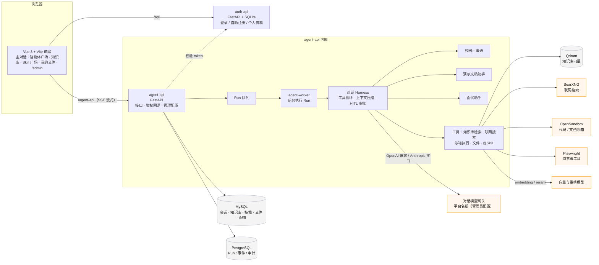

# AXIOM 校园智能体

面向一所学校部署的 AI 智能体平台：学生自助注册后，在一个统一的对话界面里使用**校园百事通**、
**演示文稿助手**、**面试助手**三个预置智能体，以及带知识库、联网搜索、技能（Skill）与文件工作区的主对话。
管理员在 `/admin` 配置模型、向量/重排服务、联网搜索与校园知识发布。

在线演示：https://clinirag.top （重庆工程学院实例）

## 功能

| 模块 | 说明 |
| --- | --- |
| 主对话 | 平台默认对话模型对所有用户生效（个人 Key 可选）；图片附件直接进多模态模型；文档附件解析；`+` 菜单挂载我的文件 / 知识库 / 最近的对话 / 技能；深度研究与计划模式；工具审批（HITL）；上下文自动压缩 |
| 校园百事通 | 只答已审核知识库 + 学校官网白名单域名内的内容，回答注明来源；管理员草稿 → 校验 → 发布 |
| 演示文稿助手 | 在沙箱里生成 pptx（含配图检索），产物进「我的文件」可下载 |
| 面试助手 | 按岗位与简历出题、逐题追问、结束给评价 |
| 我的知识库 | 上传解析、切片正本落 MySQL（ngram 全文）+ 向量入 Qdrant，向量 / 关键词 / 混合检索 + 重排，分段编辑与重建，检索日志与运营统计 |
| Skill 广场 | 按用户隔离的个人技能（直接编写 SKILL.md 或 zip 导入，版本化）；管理员可把自己的技能分发给全体用户或撤回 |
| 我的文件 | 对话产物与上传文件的工作区：文件夹、预览（Office 转 PDF）、版本历史 |
| 隐私边界 | 管理员看不到用户的会话、文件、知识库、技能（不存在即 404）；同一浏览器换人登录时本机状态按用户作用域清理 |
| 管理页 | 对话模型名册（多条，OpenAI / Anthropic 地址）、向量模型、重排模型、联网搜索、校园百事通发布、用户列表——只有这五块 |

## 架构



请求链路：浏览器只和同源的 nginx 打交道，`/api` 转到 auth-api、`/agent-api` 转到 agent-api（关闭代理缓冲以支持
SSE）；一次对话由 agent-api 受理后入 Run 队列，agent-worker 取出执行，事件流经 SSE 回到页面。管理员在 `/admin`
配置的对话模型 / 向量模型 / 重排模型 / 联网搜索都以密文落库，对全体用户生效。

详细边界见 [docs/架构概览.md](docs/架构概览.md)，主对话内部机制见
[docs/主对话-Agent-Harness-架构与开发规范.md](docs/主对话-Agent-Harness-架构与开发规范.md)。

## 目录

```text
src/                 前端；主界面在 src/views/peopleCenter/（ChatPage、BuiltinHarnessRunPage、AdminConsolePage…）
agent-api/           智能体后端：app/routers、app/services/{agent_harness,chat,knowledge,skills,files,platform}、migrations、tests
auth-api/            认证服务
deploy/              compose 用到的镜像与脚本：frontend/、opensandbox-api/、websearch-api/searxng、redeploy.sh、dev-server.sh
docker-compose.local.yml / server.yml / dev.yml   本机部署、服务器覆盖、开发模式覆盖
docs/                部署手册、开发工作流、功能清单、架构概览、模型连接配置
```

## 快速开始

### 服务器部署（单机 Docker Compose）

```bash
cp deploy/local/.env.example deploy/local/.env   # 填数据库口令、管理员密码、连接器密钥、模型网关地址
docker compose --env-file deploy/local/.env -f docker-compose.local.yml -f docker-compose.server.yml up -d
```

首次部署、日常更新（`deploy/redeploy.sh frontend|backend|all`）、数据库迁移与 3 GB 小机器上的
前端构建约束见 [docs/生产部署手册.md](docs/生产部署手册.md)。登录后在 `/admin` 配置对话模型、向量模型与
校园百事通即可使用。

### 开发模式（改代码免重建镜像）

```bash
docker compose --env-file deploy/local/.env -f docker-compose.local.yml -f docker-compose.server.yml -f docker-compose.dev.yml up -d
./deploy/dev-server.sh --daemon     # Vite dev server :3200，后端源码挂载 + --reload
```

见 [docs/本地热更新开发工作流.md](docs/本地热更新开发工作流.md)。

### 测试

```bash
pnpm test                                   # 前端单测（jest.config.cjs 分 project）
cd agent-api && pip install -r requirements-dev.txt && pytest -q tests   # 后端（含 pyflakes 静态守卫）
```

## 技术栈

Vue 3 · Vite · TypeScript · Ant Design Vue ｜ FastAPI · SQLAlchemy · Alembic ｜ MySQL · PostgreSQL · Qdrant ｜
OpenAI 兼容 / Anthropic 模型接口 · SearXNG · OpenSandbox · Playwright ｜ Docker Compose

## 许可

见 [LICENSE](LICENSE) 与 [NOTICE.md](NOTICE.md)（第三方组件声明）。
