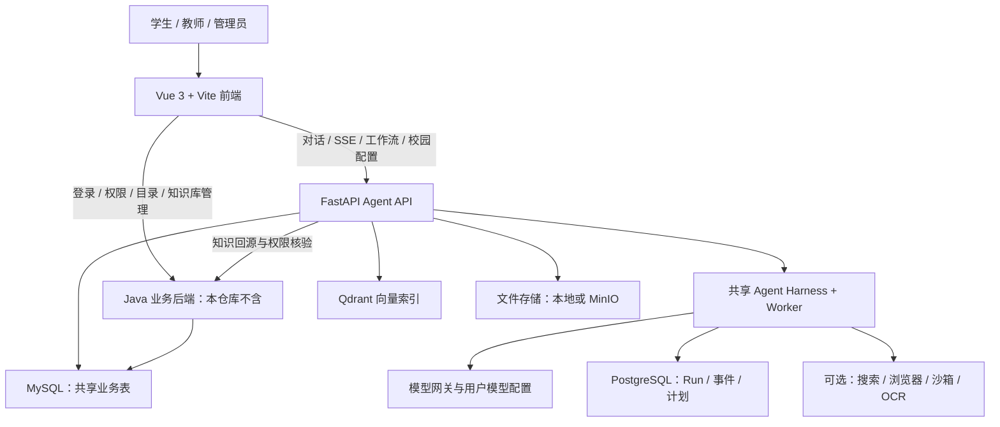

# AXIOM 项目拆解与校园复用路线

检查日期：2026-09-17。结论基于提供的工作区源码，不代表原服务器或新环境已完成业务联调。

当前工作区补充：`auth-api` 已提供 FastAPI 单管理员认证兼容实现，基本登录不再必须依赖 Java。它不等于下文的完整业务后端，知识库、目录等依赖仍需补齐。模型地址可连接本地网关或云端服务，仓库没有部署模型权重。详见 [本地认证服务](../auth-api/README.md)。

## 1. 结论

这是一套带 Agent 执行框架的 AI 平台，包含 Vue 用户端/管理端、Python Agent API、工作流、知识检索适配、文件与皮肤系统。
本次按工作区当前内容复刻到新仓库，包含原来未提交的源码改动；没有导入旧 Git 历史、服务器凭据和运行数据。

现有校园产品可以作为 AXIOM 的“官方知识问答”模块复用，但不能直接称为“十个智能体协作办事”。
校园模式显式只允许 search_knowledge、search_web 两种只读工具，拒绝客户端指定子智能体、Skill、计划模式等覆盖。
在学校资料和基础服务未配置前，源码完整也不等于产品可运行。

## 2. 实际系统结构

关键边界：

- `/center/chat`：通用主对话，具备任务执行与能力调用框架。
- `/center/chat/campus`：同一框架中的只读校园助手，按已发布配置固定知识库、域名与模型。
- `/workflow` 相关页面：可视化工作流，拥有独立的确定性执行流程。
- `/channel` 等后台页面：管理入口，不能把所有管理菜单暴露为学生首页。
- Java 拥有身份、角色、组织等业务数据；不能通过删登录保护来替代缺失后端。

## 3. 哪些可以复用

“直接复用”指保留现有实现，在必要服务接通后使用；不表示本机已经完成在线验收。

| 模块 | 代码入口 | 判断 | 接下来做什么 |
|---|---|---|---|
| 校园问答身份与页面 | `src/views/peopleCenter/builtinAssistants/campusServices/` | 直接复用 | 调整校园名称、说明、入口和角色展示 |
| 校园后台配置 | `src/views/newapi/campusAssistant/`、`agent-api/app/routers/campus_assistant.py` | 直接复用 | 配模型、知识库绑定、学校官方域名并发布 |
| 配置发布与回滚 | `agent-api/app/services/chat/builtin_assistants/campus_services/config_service.py` | 直接复用 | 配置真实租户和权限；保留版本与发布记录 |
| 每次运行的配置快照 | 同目录 `runtime_service.py` | 直接复用 | 保持发布版本可追溯，不能临时绕过未发布检查 |
| 官方域名限制 | 同目录 `domain_policy.py` | 直接复用 | 填本校域名；精确匹配主机及获准子域 |
| 依据不足拒答、来源说明 | 同目录 `policy.py` | 直接复用 | 写好真实学校知识；不让模型猜时间、地点、费用和电话 |
| 主对话与流式展示 | `src/views/peopleCenter/`、`agentApi.ts` | 直接复用 | 以校园服务组织导航、欢迎语、快捷入口 |
| 运行、计划、恢复与工具调度 | `agent-api/app/services/agent_harness/` | 复用框架 | 在新的校园协作产品策略中接入能力；不要复制第二套内核 |
| 智能体目录与子智能体调用 | `agent-api/app/services/agents/`、`chat/subagent_turn.py` | 复用框架 | 配置十个角色、检索发现、权限和输入输出协议 |
| 工作流编辑与执行 | `src/views/workflow/`、`agent-api/app/services/workflows/` | 按场景复用 | 表单、分支、用户选择、流程状态可用于办事指引 |
| 校园主题/皮肤包 | `mainChatSkin/`、`agent-api/skin_packages/` | 直接复用 | 新品牌导入导出标识已统一；历史旧格式包须迁移 |
| 用户文件、文档解析 | `agent-api/app/services/files/` | 接服务后复用 | 配存储、上传权限及清理周期；不导入原用户文件 |
| 知识检索 | `campus_services/java_knowledge.py`、`services/knowledge/` | 接服务后复用 | Java 接口、知识库 ACL、向量模型与 Qdrant 必须一致 |
| PPT、面试、邮件连接器等 | 各自模块 | 可选保留 | 不作为校园入学项目的首期必做范围 |

## 4. 当前最重要的缺口

### P0：复刻现有校园问答必须完成

1. **Java 业务后端**：本仓库没有相应 Java 源码或部署包。需要另提供兼容服务，或另立任务实现兼容认证、权限、应用目录与知识接口。
2. **业务数据库基线**：Python 有迁移文件，但不等于包含 Java `sys_user/sys_role/sys_permission` 等完整业务初始化。需取得可用的空库建库方案，不能复制原学校用户数据。
3. **登录协议参数**：登录 AES 参数、签名兼容参数已移出源码常量，需与实际 Java 配置对齐。这些浏览器参数是公开协议值，不能当服务端密钥。
4. **模型与基础服务**：配置自己的模型网关、MySQL、Runtime PostgreSQL、Qdrant。沙箱、浏览器、OCR、MinIO 按实际功能决定是否接入。
5. **学校知识**：准备真实且有来源的入学手册、缴费说明、资助流程、住宿规则、校园账号指南，记录适用年份、校区与更新时间。
6. **发布校园配置**：在管理员页面选择模型、绑定知识库、填写官方域名并发布。没有已发布配置时返回不可用是预期保护。
7. **完成业务联调**：测试真实登录、权限隔离、官方依据检索、未知问题拒答、历史恢复及手机展示。

### P1：从现有产品走向比赛要求

1. 原代码只有一个内置校园问答身份，不能用十张卡片充当十个有效智能体。
2. 新建“校园协作”产品策略，复用共享 Harness；保留原只读校园助手作为可信资料检索角色。
3. 建立学生最小化服务档案、事项状态及角色交接协议，明确数据访问权限与保留期限。
4. 为十个角色分别配置知识范围、输入、输出、失败处理和测试案例。
5. 做一条完整旅程：学生需求 → 资料核对 → 个性化办事清单 → 状态确认 → 缺失项处理 → 完成检查。
6. 真实缴费、宿舍分配、成绩查询、申请提交需要学校授权接口。尚未接通的功能只能标为指引或模拟。
7. 对照比赛平台确认“空间链接”和十个有效智能体的发布、验收方式；自建网站不自动等同于赛事指定空间。

### P2：比赛呈现

- 至少准备一组真实用户试用记录和固定测试问题。
- 记录回答依据正确率、任务清单遗漏率、完成耗时与人工干预次数。
- 展示缺材料、过期通知或不同校区规则冲突的处理过程。
- 准备项目说明、视频、封面、可访问链接与约七分钟演示脚本。

## 5. 十个校园角色的建议拆分（待实现）

| 角色 | 输入 | 输出 | 关键限制 |
|---|---|---|---|
| 新生接待 | 学院、校区、到校时间、需求 | 最小化需求卡 | 不索取无关证件信息 |
| 材料检查 | 个人情况、官方要求 | 缺失/已备齐/待确认清单 | 不能凭照片断言正式审核通过 |
| 报到流程 | 需求卡、材料状态 | 有先后顺序的行动清单 | 没有业务回执不得声称已报到 |
| 缴费指引 | 缴费问题 | 官方渠道与操作说明 | 不收密码，不代收费用 |
| 资助服务 | 用户主动提供的申请情况 | 申请步骤、材料和入口 | 不代替学校作资格裁定 |
| 住宿助手 | 校区、入住需求 | 入住步骤与报修渠道 | 分配结果只能来自正式系统 |
| 到校出行 | 出发位置、到校时间 | 路线与到达安排 | 标注实时交通信息的来源和时间 |
| 校园账号 | 所需账号及开通状态 | 开通检查表 | 不保存账号密码 |
| 入学日程 | 官方安排、个人时间 | 个人日程 | 区分官方安排与个人建议 |
| 进度验收 | 各角色输出、用户确认 | 未完成项与下一步 | 用户确认与系统实际回执分别记录 |

当前表是产品设计，不代表已经创建或发布十个可运行智能体。

## 6. 建议开发顺序

先接通 P0，让现有校园问答在新环境可靠运行；再完成角色协作与事项状态；最后接入一个可授权的真实业务接口。
优先保证“有依据地完成入学指引”这一条流程，再扩展到教务、报修等其他校园服务。

## 7. 复用和原创范围

本项目的前端基础组件、Agent 执行框架和现有校园问答实现来自提供的上游工作区。
AXIOM 的品牌调整、脱敏配置和后续校园协作设计不代表这些上游模块为团队原创。
参赛材料应分别说明复用底座、团队新增逻辑、学校资料来源和实际验证结果。
