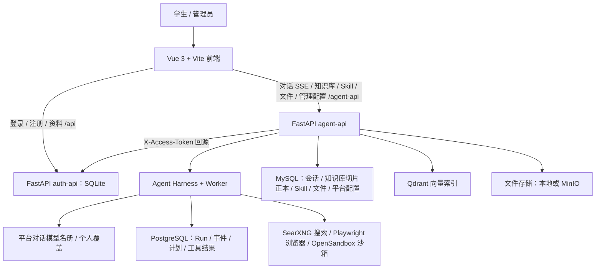

# AXIOM 项目拆解与校园复用路线

首版检查日期：2026-09-17；2026-09-19 按删除工作流编排 / 子智能体 / 皮肤系统后的源码重新核对复用表与缺口。结论基于仓库源码，不代表目标环境已完成业务联调。

## 1. 结论

这是一套带 Agent 执行框架的校园 AI 平台：Vue 3 前端、FastAPI agent-api（主对话 Harness、知识库、Skill、文件、平台配置）、FastAPI auth-api（单管理员 + 自助注册）。Java 业务后端已下线，知识库与 Skill 目录由 agent-api 自持；模型地址可连接本地网关或云端服务，仓库不含模型权重。

现有校园百事通可以作为 AXIOM 的“官方知识问答”模块直接复用，但不能直接称为“十个智能体协作办事”。校园模式只允许 `search_knowledge`、`search_web` 两种只读工具，拒绝客户端指定 Skill、计划模式等覆盖。在学校资料和基础服务未配置前，源码完整也不等于产品可运行。

## 2. 实际系统结构

关键边界：

- `/center/chat`：通用主对话，具备任务执行与能力调用框架（详见 Harness 规范）。
- `/center/chat/campus`、`/center/chat/ppt`、`/center/chat/interview`：同一框架中的三个内置助手；校园百事通按已发布配置固定知识库、域名与模型。
- `/admin`：管理配置（对话 / 向量 / 重排模型、联网搜索、校园百事通发布、用户列表），只有管理员可见。
- auth-api 拥有身份；agent-api 每次请求回源校验 Token，不能通过删登录保护来替代认证。
- 已删除、不要再找：工作流编排与 `/workflow/*`、子智能体、对外 Agent API、皮肤系统（见 [`架构概览.md`](架构概览.md) 第 5 节）。

## 3. 哪些可以复用

“直接复用”指保留现有实现，在必要服务接通后使用；不表示本机已经完成在线验收。

| 模块 | 代码入口 | 判断 | 接下来做什么 |
|---|---|---|---|
| 校园问答身份与页面 | `src/views/peopleCenter/builtinAssistants/campusServices/` | 直接复用 | 调整校园名称、说明、入口和角色展示 |
| 校园后台配置 | `src/views/peopleCenter/pages/AdminConsolePage.vue`（`/admin` 校园百事通 tab）、`agent-api/app/routers/campus_assistant.py` | 直接复用 | 选模型、绑定知识库、填学校官方域名并发布 |
| 配置发布与回滚 | `agent-api/app/services/chat/builtin_assistants/campus_services/config_service.py` | 直接复用 | 保留版本与发布记录；`/campus-assistant/admin/releases/{id}/rollback` |
| 每次运行的配置快照 | 同目录 `runtime_service.py` | 直接复用 | 保持发布版本可追溯，不能临时绕过未发布检查 |
| 官方域名限制 | 同目录 `domain_policy.py` | 直接复用 | 填本校域名；精确匹配主机及获准子域 |
| 依据不足拒答、来源说明 | 同目录 `policy.py` | 直接复用 | 写好真实学校知识；不让模型猜时间、地点、费用和电话 |
| 知识库入库与检索 | `agent-api/app/services/knowledge/`、`src/views/knowledge/` | 直接复用 | 配向量模型（`/embedding-config`）后上传学校资料；切片正本在 MySQL、向量在 Qdrant |
| 主对话与流式展示 | `src/views/peopleCenter/`、`agentApi.ts` | 直接复用 | 以校园服务组织导航、欢迎语、快捷入口 |
| 运行、计划、恢复与工具调度 | `agent-api/app/services/agent_harness/` | 复用框架 | 新的校园协作能力接进同一 Harness；不要复制第二套内核，也不要复活子智能体委派 |
| 人在环与工具审批 | `services/chat/tools/`（`ask_user_choice`）、`services/gateway/tool_gateway.py` | 复用框架 | 办事确认、材料核对等交互复用现有选择卡与审批卡 |
| 用户文件、文档解析 | `agent-api/app/services/files/` | 直接复用 | 配存储（本地或 MinIO）与清理周期；不导入原用户文件 |
| 登录、注册、个人资料 | `auth-api/`、`src/views/system/loginmini/` | 直接复用 | 生产前评估是否需要接学校统一身份；当前只有单管理员 + 自助注册 |
| 演示文稿助手、面试助手、Skill 广场、邮件/GitHub 连接器 | 各自模块 | 可选保留 | 不作为校园入学项目的首期必做范围 |

## 4. 当前最重要的缺口

### P0：复刻现有校园问答必须完成

1. **部署基础服务**：按 [`生产部署手册.md`](生产部署手册.md) 起 MySQL、Runtime PostgreSQL、Qdrant、SearXNG、auth-api、agent-api、worker；沙箱与浏览器容器按是否需要 bash / 网页工具决定。
2. **登录协议参数**：`AXIOM_LOGIN_AES_KEY` / `AXIOM_LOGIN_AES_IV` / `AXIOM_REQUEST_SIGNATURE_SALT` 前端构建期与 auth-api 必须一致；它们是公开协议值，不能当服务端密钥。
3. **模型配置**：管理员在 `/admin` 配对话模型名册、向量模型、（可选）重排模型与联网搜索；密钥只以 Fernet 密文入库，`AXIOM_CONNECTOR_SECRET` 必须稳定。
4. **学校知识**：在「我的知识库」上传真实且有来源的入学手册、缴费说明、资助流程、住宿规则、校园账号指南，记录适用年份、校区与更新时间。
5. **发布校园配置**：在 `/admin` 校园百事通 tab 选择模型、绑定知识库、填写官方域名，校验后发布。没有已发布配置时返回不可用是预期保护。
6. **完成业务联调**：测试真实登录 / 注册、权限隔离（管理员无旁路）、官方依据检索、未知问题拒答、历史恢复及手机展示。

### P1：从现有产品走向比赛要求

1. 原代码只有一个内置校园问答身份，不能用十张卡片充当十个有效智能体。
2. 新建“校园协作”产品策略，复用共享 Harness（与三个内置助手同样以 preset / 策略注册接入）；保留原只读校园助手作为可信资料检索角色。子智能体委派已删除，多角色协作需要重新设计，不要恢复旧的 `call_subagent`。
3. 建立学生最小化服务档案、事项状态及角色交接协议，明确数据访问权限与保留期限。
4. 为十个角色分别配置知识范围、输入、输出、失败处理和测试案例。
5. 做一条完整旅程：学生需求 → 资料核对 → 个性化办事清单 → 状态确认 → 缺失项处理 → 完成检查。
6. 真实缴费、宿舍分配、成绩查询、申请提交需要学校授权接口。尚未接通的功能只能标为指引或模拟。
7. 对照比赛平台确认“空间链接”和十个有效智能体的发布、验收方式；自建网站不自动等同于赛事指定空间。

### P2：比赛呈现

- 至少准备一组真实用户试用记录和固定测试问题。
- 记录回答依据正确率、任务清单遗漏率、完成耗时与人工干预次数。
- 展示缺材料、过期通知或不同校区规则冲突的处理过程。
- 准备项目说明、视频、封面、可访问链接与约七分钟演示脚本。

## 5. 十个校园角色的建议拆分（待实现）

| 角色 | 输入 | 输出 | 关键限制 |
|---|---|---|---|
| 新生接待 | 学院、校区、到校时间、需求 | 最小化需求卡 | 不索取无关证件信息 |
| 材料检查 | 个人情况、官方要求 | 缺失/已备齐/待确认清单 | 不能凭照片断言正式审核通过 |
| 报到流程 | 需求卡、材料状态 | 有先后顺序的行动清单 | 没有业务回执不得声称已报到 |
| 缴费指引 | 缴费问题 | 官方渠道与操作说明 | 不收密码，不代收费用 |
| 资助服务 | 用户主动提供的申请情况 | 申请步骤、材料和入口 | 不代替学校作资格裁定 |
| 住宿助手 | 校区、入住需求 | 入住步骤与报修渠道 | 分配结果只能来自正式系统 |
| 到校出行 | 出发位置、到校时间 | 路线与到达安排 | 标注实时交通信息的来源和时间 |
| 校园账号 | 所需账号及开通状态 | 开通检查表 | 不保存账号密码 |
| 入学日程 | 官方安排、个人时间 | 个人日程 | 区分官方安排与个人建议 |
| 进度验收 | 各角色输出、用户确认 | 未完成项与下一步 | 用户确认与系统实际回执分别记录 |

当前表是产品设计，不代表已经创建或发布十个可运行智能体。

## 6. 建议开发顺序

先接通 P0，让现有校园问答在新环境可靠运行；再完成角色协作与事项状态；最后接入一个可授权的真实业务接口。
优先保证“有依据地完成入学指引”这一条流程，再扩展到教务、报修等其他校园服务。

## 7. 复用和原创范围

本项目的前端基础组件、Agent 执行框架和现有校园问答实现来自提供的上游工作区；auth-api、知识库与 Skill 目录自持以及 2026-09-19 的功能删减是本仓库后续改动。
AXIOM 的品牌调整、脱敏配置和后续校园协作设计不代表这些上游模块为团队原创。
参赛材料应分别说明复用底座、团队新增逻辑、学校资料来源和实际验证结果。
